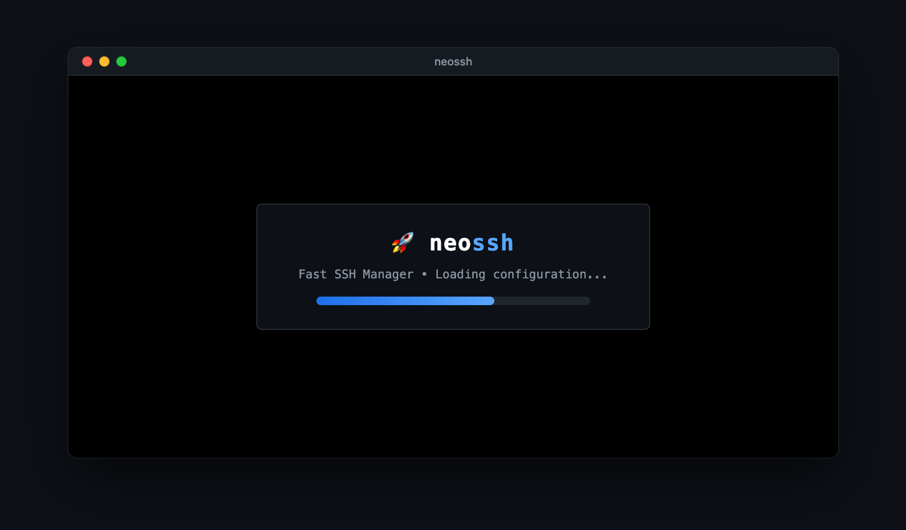
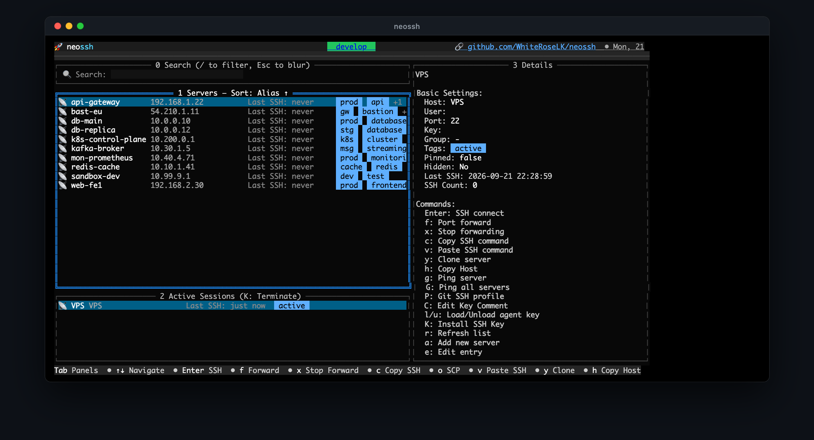
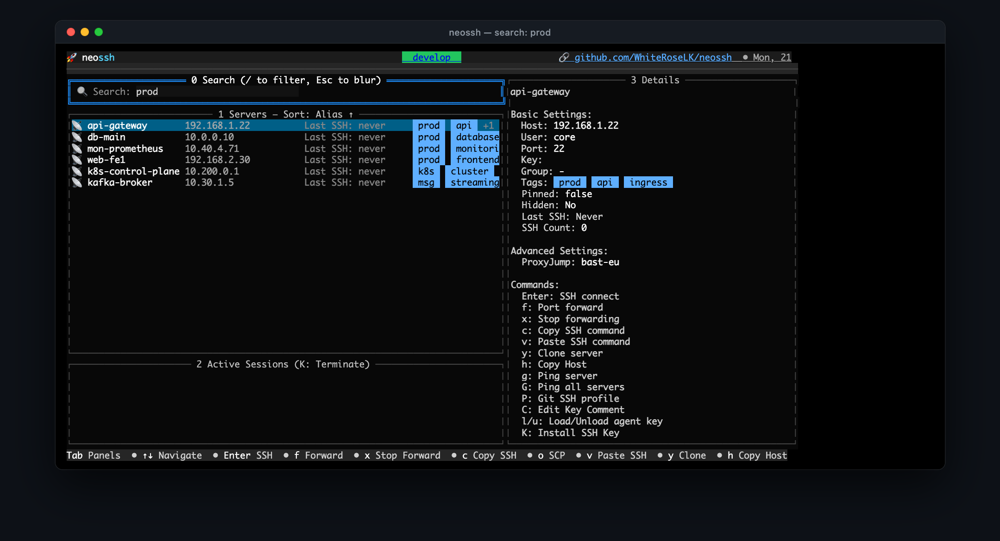
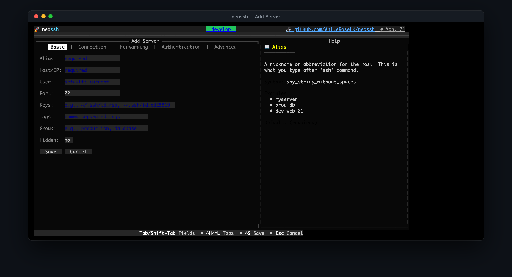
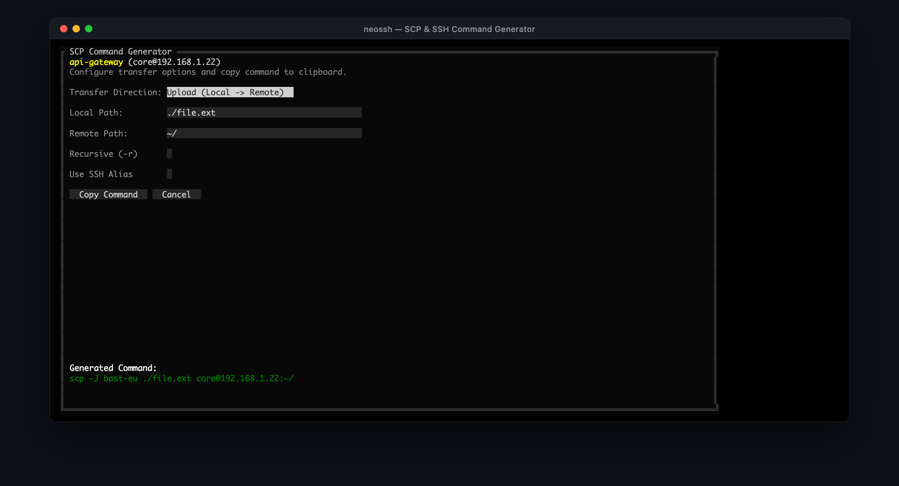

# :rocket: neossh

<div align="center">
<p><strong>An interactive, keyboard-driven SSH manager for your terminal.</strong></p>
<p><em>Maintained fork and continuation of <a href="https://github.com/Adembc/lazyssh">lazyssh</a> by <a href="https://github.com/Adembc">Adembc</a></em></p>

[](https://github.com/WhiteRoseLK/neossh/releases)
[](https://github.com/WhiteRoseLK/neossh/blob/main/LICENSE)
[](https://github.com/WhiteRoseLK/neossh/blob/main/go.mod)

</div>

---

## Why neossh?

The original [lazyssh](https://github.com/Adembc/lazyssh) repository had not seen merged changes in over a year despite dozens of open issues and community-contributed pull requests. **neossh** was born to pick up the torch and give these contributions an actively maintained home.

!!! note "Attribution"
    All core credit for the foundational idea, design, and original implementation belongs to **[Adembc](https://github.com/Adembc)**. This project exists solely because the original repository became unmaintained.

## Key Features

<div class="grid cards" markdown>

-   :material-keyboard:{ .lg .middle } **Keyboard-Driven TUI**

    ---

    Navigate, connect, and manage servers from `~/.ssh/config` with intuitive keyboard shortcuts.

-   :material-magnify:{ .lg .middle } **Advanced Search & Filters**

    ---

    Fuzzy search with filter syntax: `tag:prod`, `user:root`, `host:192.168.*`, `status:up`.

-   :material-key:{ .lg .middle } **SSH Key Management**

    ---

    Key type badges, FIDO2 detection, ssh-agent integration, key deployment, and Git SSH profiles.

-   :material-folder-network:{ .lg .middle } **SFTP & File Transfer**

    ---

    Built-in dual-pane WinSCP-style file manager or launch external tools (yazi, ranger, filezilla).

-   :material-tunnel:{ .lg .middle } **Port Forwarding & Tunnels**

    ---

    Interactive assistant for Local (`-L`), Remote (`-R`), and Dynamic SOCKS5 (`-D`) tunnels.

-   :material-certificate:{ .lg .middle } **SSH Certificates**

    ---

    Automatic certificate detection, expiry warnings, and on-demand renewal before connecting.

-   :material-shield-lock:{ .lg .middle } **Secure Password Auth**

    ---

    `sshpass` integration backed by OS keyring — passwords never stored in plaintext.

-   :material-package-variant:{ .lg .middle } **Backup & Export**

    ---

    Export configuration bundles with optional sanitization for safe team sharing.

-   :material-hook:{ .lg .middle } **Pre-Connect Hooks**

    ---

    Run VPN scripts, Wake-on-LAN, or token refresh commands automatically before connecting.

-   :material-translate:{ .lg .middle } **Themes & i18n**

    ---

    Dark/Light/System themes and multilingual support (English, French, Chinese).

</div>

## Quick Install

=== "Homebrew"

    ```bash
    brew tap WhiteRoseLK/tap
    brew install neossh
    ```

=== "Go Install"

    ```bash
    go install github.com/WhiteRoseLK/neossh/cmd@latest
    ```

=== "Binary Download"

    ```bash
    OS="$(uname -s)" ARCH="$(uname -m)"
    [ "$ARCH" = "x86_64" ] && ARCH="x86_64" || ARCH="arm64"
    curl -sL "https://github.com/WhiteRoseLK/neossh/releases/latest/download/neossh_${OS}_${ARCH}.tar.gz" | tar -xz
    sudo mv neossh /usr/local/bin/
    ```

[:material-download: Full Installation Guide](getting-started/installation.md){ .md-button .md-button--primary }

## Quick Start

```bash
# Launch interactive TUI
neossh

# Connect directly to a server
neossh -c my-server

# Pre-filtered view (great for screen shares)
neossh prod

# Quick SFTP session
neossh --sftp web-prod
```

[:material-rocket-launch: Quick Start Guide](getting-started/quickstart.md){ .md-button }

## Screenshots

<details>
<summary>Click to expand screenshots</summary>

### Startup


### Server List & Active Sessions


### Fuzzy Search


### Add / Edit Server Form


### SCP & SSH Command Generator


</details>
