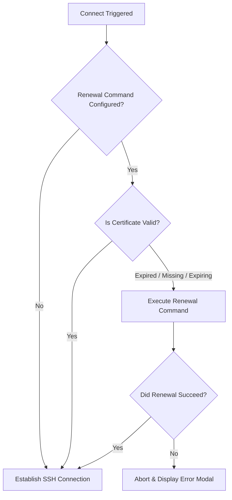

#  SSH Certificates & Auto-Renewal

`neossh` provides first-class support for OpenSSH short-lived certificates, addressing the modern enterprise paradigm of ephemeral credentials (Smallstep, HashiCorp Vault, Teleport, Okta, etc.).

---

## Certificate Detection & Status Display

`neossh` inspects certificates specified by `CertificateFile` in your `~/.ssh/config` or automatically discovers implicit certificate files alongside your identity keys (e.g. `<IdentityFile>-cert.pub`).

### Status Badges in Server Details

When inspecting a server in the **Details** panel (<kbd>3</kbd>), `neossh` parses the certificate headers and displays live information:

| Status Badge | Meaning |
|---|---|
|  `✓ Valid` | Certificate is currently active and within its valid time window. |
|  `⚠ Expiring soon` | Certificate is approaching expiration (proportional threshold). |
|  `✗ Expired` | Certificate validity period has ended. Connection may fail. |

Additional details displayed:
- **Remaining Lifetime**: Exact time left before expiration (e.g., `42m remaining`, `5d remaining`).
- **Validity Window**: From date/time to expiration date/time.
- **Principals**: Allowed usernames (e.g. `ubuntu`, `admin`, `root`).
- **Key ID / Serial**: Certificate identifier assigned by the Certificate Authority (CA).

### Dynamic Proportional Expiry Warnings

Rather than using a rigid static cutoff, `neossh` calculates the "expiring soon" warning proportionally to the certificate's total lifetime:
- For short-lived 1-hour certificates (typical in Zero Trust / OIDC setups), the warning appears around 6 minutes prior to expiry.
- For longer 30-day certificates, the warning triggers 24 hours prior to expiry.

---

## On-Demand Certificate Renewal

Eliminate repeated manual MFA/OIDC logins with smart, on-demand certificate renewal right before SSH connects.

### How It Works

1. When you initiate an SSH connection (<kbd>enter</kbd> or `-c`), `neossh` checks whether a certificate renewal command is configured for the host.
2. **If the certificate is still valid**, `neossh` skips renewal completely and connects immediately with zero latency.
3. **If the certificate is missing, expired, or expiring soon**, `neossh` executes the renewal command once.
4. `neossh` verifies on disk that a valid certificate was produced, and then proceeds with the SSH connection.



---

## Configuration

### In `~/.ssh/config` Comments

You can define renewal hooks using comment directives inside the `Host` block or inline on the `Host` line:

```ssh-config
# Smallstep CLI renewal example
Host prod-bastion # certificate-command: step ssh login %u@%h
    HostName bastion.corp.internal
    User devops
    IdentityFile ~/.ssh/id_ecdsa
    CertificateFile ~/.ssh/id_ecdsa-cert.pub

# HashiCorp Vault example
Host k8s-node-01
    # cert-command: vault write -field=signed_key ssh-client-signer/sign/developer public_key=@~/.ssh/id_ed25519.pub > ~/.ssh/id_ed25519-cert.pub
    HostName 10.200.0.12
    User ubuntu
    IdentityFile ~/.ssh/id_ed25519

# Teleport tsh login example
Host staging-app
    # cert-renew: tsh login --proxy=teleport.example.com:443
    HostName app.staging.internal
    User admin
```

Supported comment prefixes:
- `# certificate-command: <cmd>`
- `# cert-command: <cmd>`
- `# cert-renew: <cmd>`

### Via the TUI

1. Highlight the server and press <kbd>e</kbd> to edit.
2. Navigate to the **Advanced** or **Certificates** section.
3. Enter your renewal command in the **Certificate Renewal Command** input field.
4. Save the form. `neossh` updates the SSH configuration comment automatically.

---

## Token Expansions

Just like [[Pre-Connect Hooks|Pre-Connect-Hooks]], certificate renewal commands support dynamic tokens:

| Token | Replaced With | Example |
|---|---|---|
| `%h` | Remote HostName / IP address | `10.200.0.12` |
| `%p` | Remote SSH Port | `22` |
| `%r` | Remote Username | `ubuntu` |
| `%u` | Remote Username (alias of `%r`) | `ubuntu` |
| `%n` | Server Alias in SSH Config | `prod-bastion` |
| `%%` | Literal `%` character | `%` |

---

## Diagnostic SSH Error Modals

If a connection fails due to an expired certificate, `neossh` analyzes OpenSSH subprocess errors (`Certificate expired`, `Key or certificate invalid`, `Permission denied (publickey)`). The resulting diagnostic error modal explicitly highlights certificate expiration as the probable cause, saving you from troubleshooting network or firewall issues unnecessarily.
